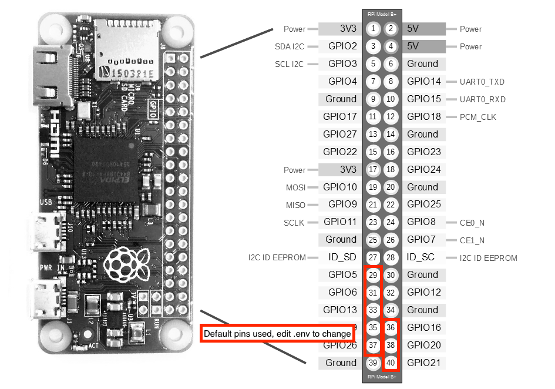

# Martins' Sprinklers
"Smart" Sprinkler System written in Node for Raspberry Pi.

Features:

- Basic, responsive web page to control and monitor sprinkler zones
- Basic server to control pins (and thus relays) with a Raspberry Pi

## Install
### Prerequisites
* node (~8)
* npm
* gpio-admin - see https://www.npmjs.com/package/pi-gpio for install instructions.

#### Node & NPM - Install on Raspberry Pi
*Tested with Node 8.9.4*

Determine architecture:

    uname -m

Look for armv6 (vs 7, etc). For arm v6 (Raspberry Pi Zero + maybe others), download the node binary and untar:

    wget https://nodejs.org/dist/v8.9.0/node-v8.9.0-linux-armv6l.tar.gz
    tar -xzf node-v8.9.0-linux-armv6l.tar.gz

Enter the package directory and test:

    cd node-v8.9.0-linux-armv6l/
    ./bin/node -v

If you see a node version, it works with your architecture! Now, it's safe to copy to a spot in your path:

    sudo cp -R * /usr/local/

Feel free to double check that it's now in your path, and that it works:

    node -v
    npm -v

#### Install martins-sprinklers
On your pi, clone the repo:

    git clone https://github.com/atmartins/martins-sprinklers.git
    cd martins-sprinklers

Adjust values in `.env` and `./install/cron/martins-sprinklers` if desired, then:

    ./install-on-pi.sh

#### (Optional) Set system time & timezone on pi

    sudo raspi-config

## Connecting Pins
Here are the default pins referenced by `.env`:

## Use
### Start

#### >>>> Note: The app is started after reboot! See ./install/cron/martins-sprinklers <<<< 
*Pin control requires root access* `sudo npm start`

### Turn channel(s) on or off
There are a few endpoints that can be interacted with. I'm running this on my Raspberry Pi on my local network at `localhost:3217`

#### HTTP Verb  - URL - Explanation
* `GET` - `http://localhost:3217/channel/all/on` - Turn all channels on.
* `GET` - `http://localhost:3217/channel/all/off` - Turn all channels off.

The following work the same for channels 1-8:
* `GET` - `http://localhost:3217/channel/1/on` - Turn channel 1 on.
* `GET` - `http://localhost:3217/channel/1/off` - Turn channel 1 off.
* `GET` - `http://localhost:3217/channel/1` - Get channel 1's state.

Returns an object like:

    {
      id: 1,
      state: 'on',
      msg: 'Zone 1 is on.'
    }

or a similarly-shaped error.

### Schedule
Good 'ol cron + curl is used to show how a schedule can control various zones.

The server app is started via cron here, as well.

Edit `./install/cron/martins-sprinklers` before install, or `/etc/cron.d/martins-sprinklers` after.

    @reboot sudo /usr/local/bin/node /home/pi/martins-sprinklers/index.js &

    # Zone 1, blueberries - At 5am, errday, for 15 minutes.
    0 5 * * *    curl -X GET localhost:3217/channel/1/on
    15 5 * * *   curl -X GET localhost:3217/channel/1/off

    # Zone 2, main garden - At 5:16am, errday, for 20 minutes.
    16 5 * * *   curl -X GET localhost:3217/channel/2/on
    36 5 * * *   curl -X GET localhost:3217/channel/2/off

    # Zone 3, lawn - At 5:45am, errday, for 30 minutes.
    45 5 * * *   curl -X GET localhost:3217/channel/3/on
    15 6 * * *   curl -X GET localhost:3217/channel/3/off

    # Zone 4, herbs - At 6:16am, errday, for 10 minutes.
    16 6 * * *   curl -X GET localhost:3217/channel/4/on
    26 6 * * *   curl -X GET localhost:3217/channel/4/off

## Development
If developing with OSX, start the server with:

    PHYSICAL_ENV=osx LOG_FILE_PATH=./ignored/log.json node index.js

Then visit localhost:3217 in your browser. A mock class is provided for gpio pins, to simulate them turning on and off. View the server log to confirm their state.

**More** [https://aaronmartins.com/articles/sprinklers-node-raspberry-pi/](https://aaronmartins.com/articles/sprinklers-node-raspberry-pi/)

# Install docker (pug1)

    sudo snap install docker

## InfluxDB
Set up the database:

    curl -POST http://localhost:8086/query --data-urlencode "q=CREATE DATABASE martinssprinklers"

## Grafana
Runs on port 3000

Default login is `admin` `admin`